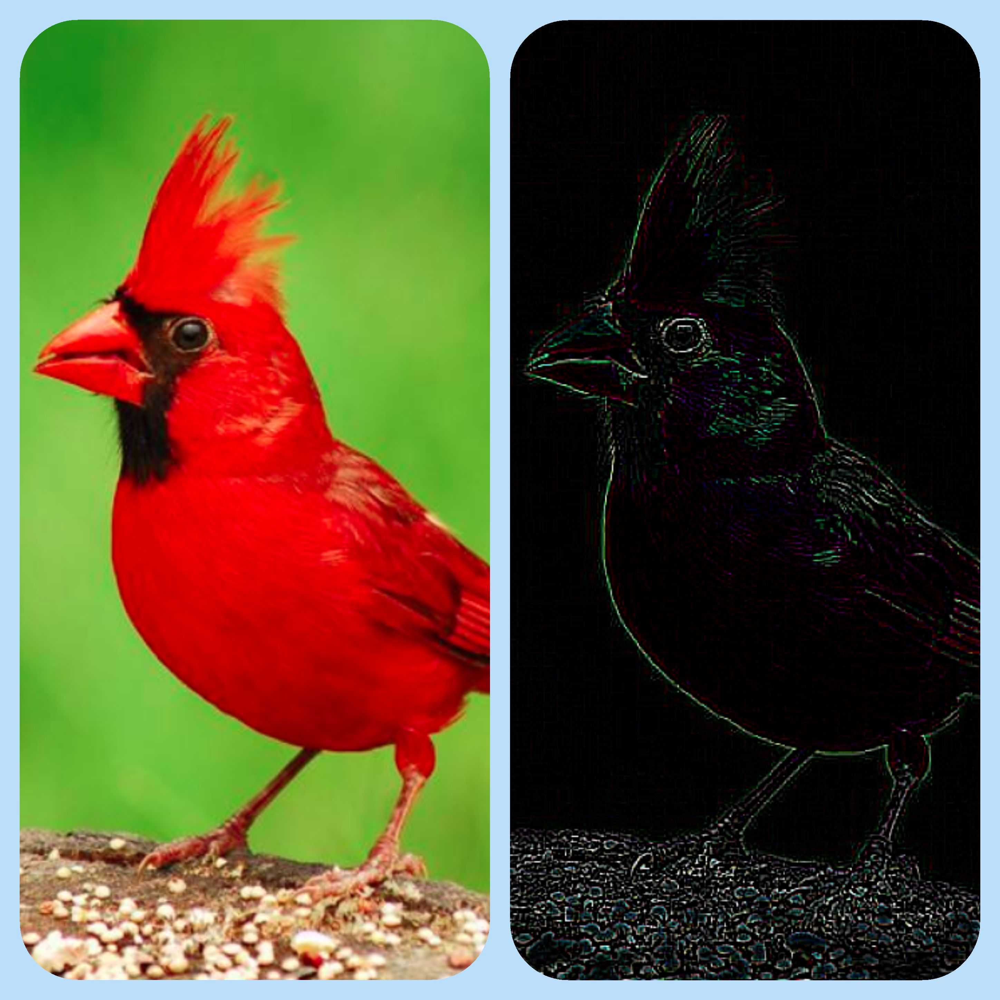
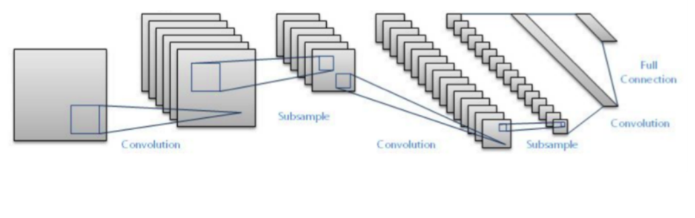

Team members:
1. Manish Shukla (shukla.me@gmail.com)
2. Prashant Shinagare (techemerging1@gmail.com)
3. Pruthiraj Jayasingh (data.pruthiraj@gmail.com)
4. Yadunandan Huded (yadunandanlh64@gmail.com)


## 1. What are Channels and Kernels(According to EVA)?

## Channels

Channels here is a collection of features like edges and gradients in an image, where feature is a piece of information about gradients and edges in the image . And gradients are basically the direction of change in color intensity.  

for example:
if you consider a coloured image, it contains 3 separate channels called Red, blue, green.  There  are other components like edges and gradients that are also treated as channels. Fig 1.2(edges) shows one such channel here. To fetch all these different channels we use kernels/filters. The operation of fetching channels/feature maps is known as convolution. 

## Kernels/filters: 

Kernels are used to extract different features from a image by convolving on top of the image. Kernel is a small matrix which can be used to perform many operations on an Image. The kernel can be of any size i.e., 3x3, 5x5, 7x7 etc. 

Using kernel we can extract features like vertical edges, horizontal edges, gradients etc. Kernels are also used in blurring, sharpening, edge detection. Following code uses a kernel which works as edge extractor of the image.

```python
import cv2
import numpy as np
#your image
img = cv2.imread(r'Path\\*.png')
'''
Edge detection Kernal
-1 -1 -1 
-1  8 -1
-1 -1 -1
'''
x = [[-1,-1,-1],[-1,8,-1],[-1,-1,-1]]
kernel = np.asarray(x)
output_image = cv2.filter2D(img,-1,kernel)
cv2.imwrite(r'Path\\blurred.png',output_image) 

```




​                                                             Fig 1.1                                                      Fig 1.2

The above images shows the image before and after applying edge detection filter.​                               


## 2. Why should we only (well mostly) use 3x3 Kernels?

Most of the time we prefer 3x3 kernals because using multiple 3x3 kernals we can reproduce effect of convolution operation by kernels of different sizes.

If we apply 3x3 kernel twice to get a final value, we actually use (3x3 + 3x3) weights. So, with smaller kernel sizes, we get lower number of weights and more number of layers. Due to this 3X3 kernels are computationally efficient and larger number of layers helps to extract complex and non-linear features with ease.

for example:

1) The effect of convolution operation  by 5x5 is replicated by convolving an image twice using  two 3x3 kernels. similarly effect of 7x7 kernel by three 3x3 kernels and so on.

Because of this salient property of 3x3 kernels many of the algorithms and  gpu computations are optimized for 3x3 kernels.  


## 3. How many times do we need to perform 3x3 convolution operation to reach 1x1 from 199x199 (show calculations).

 Each time we perform a convolution operation on image, the size of the image is reduced by 2x2. it means if we have a 5x5 metric to reach to 1x1 we need to go by 5x5 -> 3x3 -> 1x1. 

if the image size is 199x199 to we need to perform 99 convolution operations to reach 1x1.

#### Calculation:

Assuming the image has only one channel.

 199 x 199 x 1 | 3x3x1| 197 x 197 x 1

 197 x 197 x 1 | 3x3x1| 195 x 195 x 1

 195 x 195 x 1 | 3x3x1| 193 x 193 x 1

​                           ……...

5 x 5 x 1           | 3x3x1|         3 x 3 x 1      …… 98th convolution

3 x 3 x 1           | 3x3x1|         1 x 1 x 1.     …… 99th convolution


Detailed Steps:

199x199 =>, 197x197 =>, 195x195 =>, 193x193 =>, 191x191 =>, 189x189 =>, 187x187=>, 185x185 =>, 183x183 =>, 181x181 =>, 179x179 =>, 177x177 =>, 175x175 =>, 173x173=>, 171x171 =>, 169x169 =>, 167x167 =>, 165x165 =>, 163x163 =>, 161x161 =>, 159x159=>, 157x157 =>, 155x155 =>, 153x153 =>, 151x151 =>, 149x149 =>, 147x147 =>, 145x145=>, 143x143 =>, 141x141 =>, 139x139 =>, 137x137 =>, 135x135 =>, 133x133 =>, 131x131=>, 129x129 =>, 127x127 =>, 125x125 =>, 123x123 =>, 121x121 =>, 119x119 =>, 117x117=>, 115x115 =>, 113x113 =>, 111x111 =>, 109x109 =>, 107x107 =>, 105x105 =>, 103x103=>, 101x101 =>, 99x99 =>, 97x97 =>, 95x95 =>, 93x93 =>, 91x91 =>, 89x89 =>, 87x87 =>,85x85 =>, 83x83 =>, 81x81 =>, 79x79 =>, 77x77 =>, 75x75 =>, 73x73 =>, 71x71 =>, 69x69=>, 67x67 =>, 65x65 =>, 63x63 =>, 61x61 =>, 59x59 =>, 57x57 =>, 55x55 =>, 53x53 =>,51x51 =>, 49x49 =>, 47x47 =>, 45x45 =>, 43x43 =>, 41x41 =>, 39x39 =>, 37x37 =>, 35x35=>, 33x33 =>, 31x31 =>, 29x29 =>, 27x27 =>, 25x25 =>, 23x23 =>, 21x21 =>, 19x19 =>,17x17 =>, 15x15 =>, 13x13 =>, 11x11 =>, 9x9 =>, 7x7 =>, 5x5 =>, 3x3 =>, 1x1


## 4. How are kernels initialized?.

The kernels in CNN are initialised with some normally distributed random numbers. Later these weights are updated during training using back propagation.


## 5. What happens during the training of a CNN?.

Initially the kernel is first initialised with some normally distributed random numbers. Then the kernel slides over the input image and does a summation on dot products on each slide. After every layer the kernel learns new features. During initial layers CNN learns about edges and gradients, textures and patterns in middle layers and in later layers CNN learns about parts of objects and complete objects.  

CNN can able to see all the objects once we reach required global receptive field. 


For Example:

Consider example of classifying handwritten digits. Then the layers of the CNN looks as below

Input layer:

We provide Training images and labels to the first layer. From here we start convolution operation on input images. 

During convolution operation kernel moves over the image by performing dot product on a sub-region of the image pixel values and sum them to get the output. The kernel matrix is randomly initialised. 

Hidden layers:

Initial layers will extract edges and gradients, followed by textures and patterns in middle layers and in later layers CNN learns about parts of objects and complete objects. 

Output layer:

If we are classifying 10 classes then the output layer will have the vector of size 10. This vector would be a one hot vector.

For example in MNIST data set the label for 4 will be represented as [0,0,0,0,1,0,0,0,0,0]. 

 