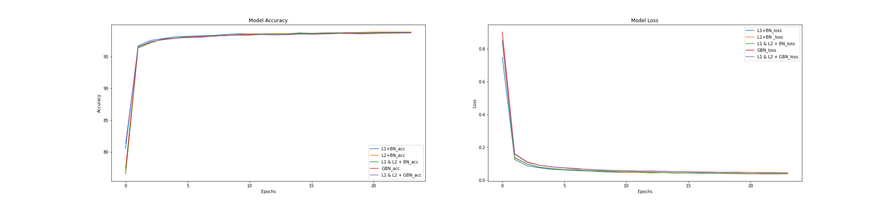
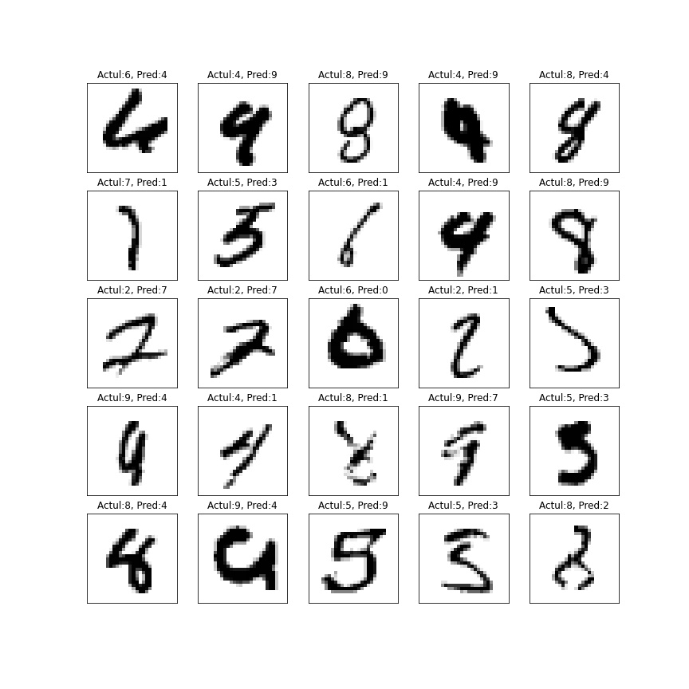
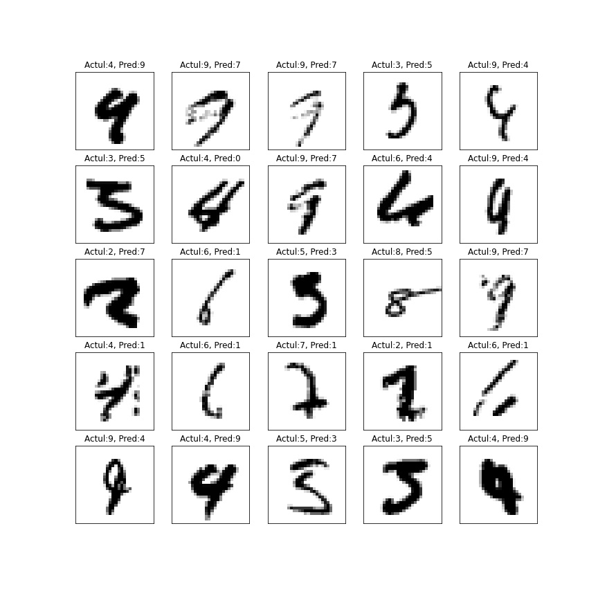
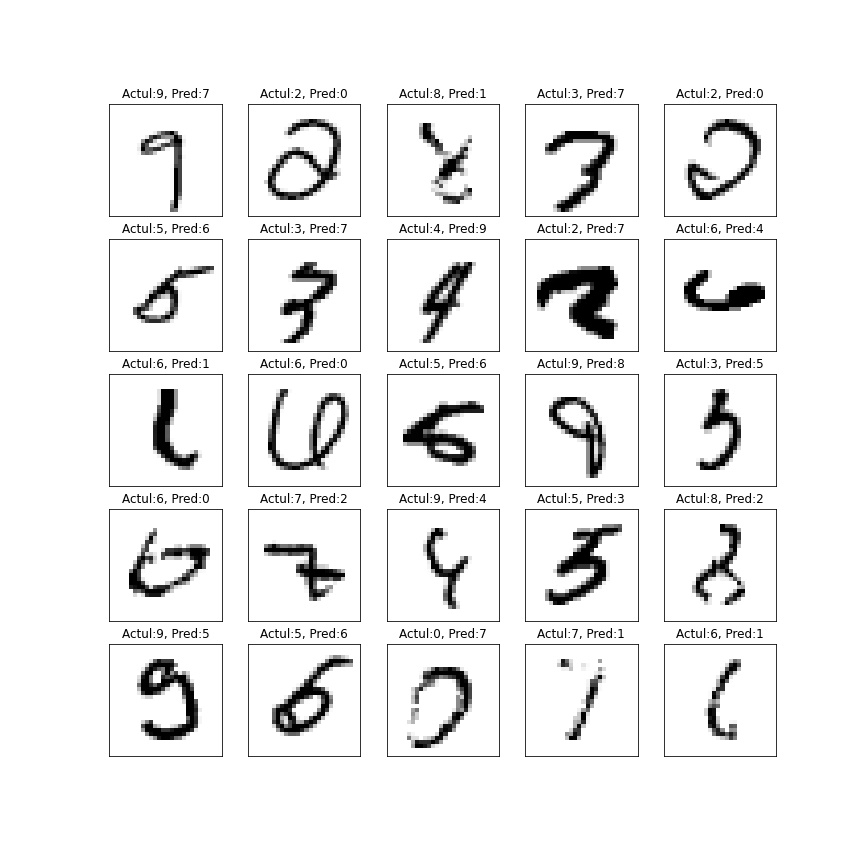

Team

1> Abhinav Rana (rabhinavcs@gmail.com)

2> Prashant Shinagare (techemerging1@gmail.com)

3> Pruthiraj Jayasingh (data.pruthiraj@gmail.com)

### What is code about ?

Applying and testing the effects of L1 and L2 Loss Regularisation and how it affects our data-set ( over 25 epochs).Following combinations of Regularisation were applied to the code. Same mode is run 

1. with L1 + BN
2. with L2 + BN
3. with L1 and L2 with BN
4. with GBN
5. with L1 and L2 with GBN

and best Test and Training Accuracy was observed.

---

### Findings

| Regularisation     | Best Training Accuracy | Test Accuracy |
| ------------------ | ---------------------- | ------------- |
| L1 + BN            | 98.83%                 | 99.37%        |
| L2 + BN            | 98.87%                 | 99.43%        |
| L1 and L2 with BN  | 98.84%                 | 99.45%        |
| GBN                | 98.73%                 | 99.40%        |
| L1 and L2 with GBN | 98.68%                 | 99.31%        |

---

### Miss-classified Images

1. with L1 + BN

   ​	

2. with L2 + BN

   

3. with L1 and L2 with BN

   

4. with GBN

   

5. with L1 and L2 with GBN

   

---

